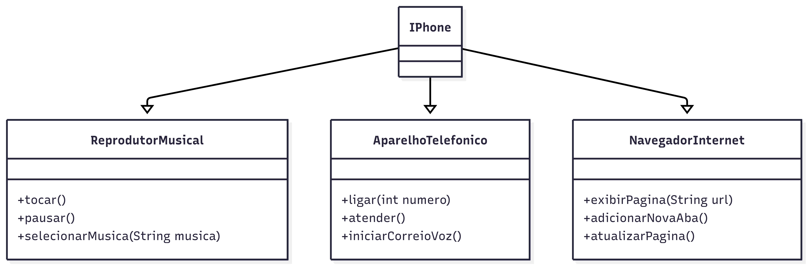

# 📱 Diagrama UML - iPhone

Este projeto apresenta um **diagrama UML** que modela o componente **iPhone** com base nas funcionalidades destacadas no vídeo de lançamento do iPhone original (2007). O foco está na representação orientada a objetos utilizando **interfaces** e uma **classe concreta**.

## 🔍 Funcionalidades Modeladas

O iPhone é representado como uma classe que implementa três interfaces:

- **ReprodutorMusical**
  - `tocar()`
  - `pausar()`
  - `selecionarMusica(String musica)`

- **AparelhoTelefonico**
  - `ligar(int numero)`
  - `atender()`
  - `iniciarCorreioVoz()`

- **NavegadorInternet**
  - `exibirPagina(String url)`
  - `adicionarNovaAba()`
  - `atualizarPagina()`

## 📊 Estrutura UML

## 🚀 Objetivo Educacional

Este modelo foi desenvolvido como parte de um desafio de POO (Programação Orientada a Objetos), visando exercitar:
- Abstração
- Implementação por interface
- Organização de responsabilidades em componentes de software

